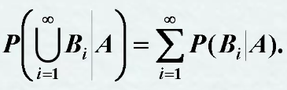
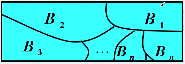
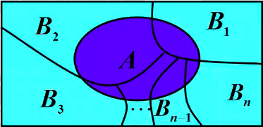
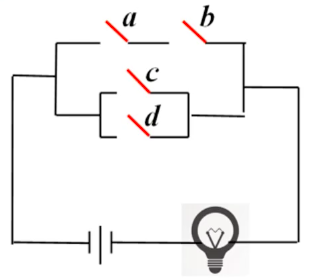

<!-- vim-markdown-toc GFM -->

* [条件概率](#条件概率)
	* [定义](#定义)
	* [性质](#性质)
	* [乘法定理](#乘法定理)
	* [例题](#例题)
* [全概率公式与贝叶斯公式](#全概率公式与贝叶斯公式)
	* [样本空间的划分](#样本空间的划分)
	* [全概率公式](#全概率公式)
	* [例题](#例题-1)
	* [贝叶斯公式](#贝叶斯公式)
	* [例题](#例题-2)
	* [作业](#作业)
* [随机事件与概率](#随机事件与概率)
	* [事件的独立性](#事件的独立性)
	* [性质 1.5.1](#性质-151)
	* [事件独立与互斥的关系](#事件独立与互斥的关系)
	* [事件独立性的判断](#事件独立性的判断)
	* [性质 1.5.2 多个事件的相互独立性](#性质-152-多个事件的相互独立性)
	* [例题](#例题-3)
	* [试验的独立性](#试验的独立性)
		* [n 重伯努里试验](#n-重伯努里试验)
	* [总结](#总结)
	* [作业](#作业-1)

<!-- vim-markdown-toc -->

# 条件概率
1. 将一枚硬币抛掷两次，观察其出现正反两面的情况，设事件 A 为“至少有一次为正面”，事件 B 为”两次掷出同一面”。现在来求已知事件 A 已经发生条件下事件 B 发生的概率。
	- 分析$S = \left\{ HH, HT, TH, TT \right\}$
	- $A = \left\{ HH, HT, TH \right\} ,  B = \left\{ HH, TT \right\}$, $P(B) = \frac{2}{4} = \frac{1}{2}$
	- 事件 A 已经发生的条件下事件 B 发生的概率
		- 记为 $P(B|A)$，则 $P(B|A)=\frac{1}{3}=\frac{\frac{1}{4}}{\frac{3}{4}}=\frac{P(AB)}{P(A)} \neq P(B)$
## 定义
- 设 A，B 是两个事件，且 $P(A) > 0$, 称
- $P(B|A)=\frac{P(AB)}{P(A)}$
- 同理可得
- $P(A|B)=\frac{P(AB)}{P(B)}$
- 为事件 B 事件下事件 A 发生的条件概率。

## 性质
1. 非负性：$P(B|A) \geq 0$
1. 规范性：$P(S|A) = 1, P(\phi|A) = 0$
1. $P(B_1 \cup B_2|A) = P(B_1|A) + P(B_2|A) - P(B_1B_2|A)$
1. $P(B|A) = 1 - P(B^-|A)$
1. **可列可加性：设** $B_1, B_2 \cdots是两两不相容的事件，则有$ 

## 乘法定理
1. $P(A) > 0 则有 P(AB) = P(B|A)P(A)$
1. 设 $A, B, C 为事件，且 P(AB) > 0, 则有 P(ABC) = P(C|AB) P(B|A) P(A)$
1. 推广 设 $A_1, A_2, \cdots, A_n 为 n 个事件，n \geq 2, 且 P(A_1 A_2 \cdots A_{n-1}) > 0, 则有：$
- $P(A_1 A_2 \cdots A_n) = P(A_n|A_1 A_2 \cdots A_{n-1}) \times P(A_{n-1}|A_1 A_2 \cdots A_{n-2})\times \cdots \times P(A_2|A_1) P(A_1)$

## 例题
- 例 1：一盒子装有 4 只产品，其中有 3 只一等品、1 只二等品，从中取产品两次，每次任取一只，做不放回抽样，设事件 A 为“第一次取到的是一等品”、事件 B 为“第二次取到的是一等品”。试求条件概率 $P(B|A)$
	- 当时间 A 发生时，盒子内共有 3 只产品，一等品只有 2 只了，故 $P(B|A) = \frac{2}{3}$

- 例 2：某种动物由出生算起活 20 岁以上的概率为 0.8，活到 25 岁以上的概率为 0.4，如果现在有一个 20 岁的这种动物，问他能活到 25 岁以上的概率是多少？
	- 设 A 表示“能活 20 岁以上” 的事件，B 表示"能活 25 岁以上" 的事件，则有 $P(B|A) = \frac{P(AB)}{P(A)}$
	- 因为 $P(A) = 0.8, P(B) = 0.4, P(AB) = P(B)$
	- 所以 $P(B|A) = \frac{P(AB)}{P(A)} = \frac{0.4}{0.8} = \frac{1}{2}$

- 例 3：五个阄，其中两个阄内写着“有”字，三个阄内不写字，五个人一次抓取，问个人抓到“有”字阄的概率是否相同。
	- 设 $A_i$ 表示“第i 人抓到有字阄”的事件，
	- $i = 1, 2, 3, 4, 5$ 则有：$P(A_1) = \frac{2}{5}$,
	- $P(A_2) = P(A_2S) = P(A_2 \cap (A_1 \cup A_1^-))$
	 $=P(A_1A_2 \cup A_1^-A_2) = P(A_1A_2) + P(A_1^-A_2)$
	 $=P(A_1)P(A_2|A_1) + P(A_1^-)P(A_2|A_1^-)$
	 $= \frac{2}{5} \times \frac{1}{4} + \frac{3}{5} \times \frac{2}{4} = \frac{2}{5}$
	- 以此类推：$P(A_4) = P(A_5) = \frac{2}{5}$
	- 与抓阄顺序无关

- 例 4：设袋中装有 r 只红球、t 只白球。每次自袋中任取一只球，观察其颜色然后放回，并再放入$\alpha$只，与所取出的那支球同色的球，若在袋中连续取球四次，试求第一、二次取到红球且第三、四次取到白球的概率
	- 设$A_i(i = 1, 2, 3, 4)$ 为事件“第 i 次取到红球”，则$A_3^-, A_4^-$ 为事件第三、四次取到白球。
	- 因此所求概率为
	  $P(A_1A_2A_3^-A_4^-)$
	 $= P(A_4^-|A_1A_2A_3^-)P(A_3^-|A_1A_2)P(A_2|A_1)P(A_1)$
	 $= \frac{t+a}{r+t+3a}\cdot \frac{t}{r+t+2a}\cdot \frac{r+a}{r+t+a}\cdot \frac{r}{r+t}$
	- **此模型被波利亚用来作为描述传染病的数学模型**

- 例 5：设某光学仪器厂制造的透镜，第一次落下时打破的概率为$ \frac{1}{2} $, 若第一次落下未打破，第二次落下打破的概率为 $ \frac{7}{10} $, 若前两次落下未打破，第三次落下打破的概率为 $ \frac{9}{10} $. 试求透镜落下三次而未打破的概率.
	- 以$A_i(i = 1, 2, 3)$ 表示事件“透镜第 i 次落下打破”，以 B 表示事件“透镜落下三次而未打破”。
	- 因为 $B = A_1^-A_2^-A_3^-$
	- 所以 $B = P(A_1^-A_2^-A_3^-) = P(A_3^-|A_1^-A_2^-)P(A_2^-|A_1^-)P(A_1^-)$
	 $= (1 - \frac{9}{10})(1 - \frac{7}{10})(1 - \frac{1}{2})$
	 $= \frac{3}{200}$

<!-- vim-markdown-toc GFM -->

* [全概率公式与贝叶斯公式](#全概率公式与贝叶斯公式)
	* [样本空间的划分](#样本空间的划分)
	* [全概率公式](#全概率公式)
	* [例题](#例题)
	* [贝叶斯公式](#贝叶斯公式)
	* [例题](#例题-1)
	* [作业](#作业)
* [随机事件与概率](#随机事件与概率)
	* [事件的独立性](#事件的独立性)
	* [性质 1.5.1](#性质-151)
	* [事件独立与互斥的关系](#事件独立与互斥的关系)
	* [事件独立性的判断](#事件独立性的判断)
	* [性质 1.5.2 多个事件的相互独立性](#性质-152-多个事件的相互独立性)
	* [例题](#例题-2)
	* [试验的独立性](#试验的独立性)
		* [n 重伯努里试验](#n-重伯努里试验)
	* [总结](#总结)
	* [作业](#作业-1)

<!-- vim-markdown-toc -->
# 全概率公式与贝叶斯公式

## 样本空间的划分
- 定义：设$S$为试验$E$的样本空间，$B_1, B_2 \cdots, B_n$为$E$的一组事件，若
	1. $B_iB_j = \phi, i \neq j, i, j = 1, 2, \cdots, n$
	2. $B_1 \cup B_2 \cup \cdots \cup B_n = S$
- 则称$B_1, B_2, \cdots, B_n$为样本空间$S$的一个划分 

## 全概率公式
- 定理：设试验$E$ 的样本空间为$S$, $A$为 E 的事件，$B_1, B_2, \cdots, B_n为S的一个划分，且 P(B_i)>0(i=1, 2, \cdots,n)$, 则 
- 为全概率公式
- 说明：全概率公式的主要用处在于他可以讲一个复杂事件的概率计算问题，分解为若干个简单是件的概率计算问题，最后应用概率的可加性求出最终结果。其证明类似于例题 3 中抓阄的解答。
- 

## 例题
- 有一批同一型号的产品，已知其中由一厂生产的占30%,二厂生产的占 50%，三厂生产的占 20%，又知这三个厂的产品次品率分别为 2%，1%，1%，问从这批产品中任取一件是次品的概率是多少？
	- 设事件$A$为“任取一件为次品”, 
	- 事件$B_i 为“任取一件为 i 厂的产品”,i = 1, 2, 3$
	- $B_1 \cup B_2 \cup B_2 = S$
	- $B_iB_j = \phi, i,j = 1, 2, 3$
	- 
	- $P(A) = P(A|B_1)P(B_1) + P(A|B_2) + P(A|B_3)P(B_3) = 0.02 \times 0.3 + 0.01 \times 0.5 + 0.01 \times 0.2 = 0.013$

## 贝叶斯公式
- 定理：设试验 $E 的样本空间为 S. A 为 E 的事件，B_1, B_2 \cdots, B_n 为 S 的一个划分，且 P(A) > 0, P(B_i) > 0, (i = 1, 2, \cdots, n)$, 则：
- $P(B_i|A) = \frac{P(A|B_i)P(B_i)}{\sum_{j=1}^{n}P(A|B_j)P(B_j)}, i = 1, 2, \cdots, n.$
- 证明：
	- $P(B_i|A) = \frac{P(B_iA)}{P(A)}$
	 $= \frac{P(A|B_i)P(B_i)}{\sum_{j=1}^{n}P(A|B_j)P(B_j)}, i = 1, 2, \cdots, n.$

## 例题
- 某电子设备制造厂所用的元件是由三家元件制造厂提供的，根据以往的记录有以下的数据：
	| 元件制造厂 | 次品率 | 提供原件的份额 |
	|------------|--------|----------------|
	| 1          | 0.02   | 0.15           |
	| 2          | 0.01   | 0.80           |
	| 3          | 0.03   | 0.05           |
- 设这家三工厂的产品在仓库中是均匀混合的，且无区别的标志。
	- 在仓库中随机的取一只原件，求他是次品的概率；
	- 在仓库中随机的取一只原件，若已知取到的是次品，为分析此次品出自何厂，需求出此次品由三家工厂生产的概率分别是多少，试求这些概率。
- $设A表示“取到的是一只次品”，B_i(i =1, 2, 3), 表示“所取到的产品是由第 i 家工厂提供的”。则 B_1, B_2, B_3是样本空间 S 的一个划分$
 且$P(B_1) = 0.15, P(B_2) = 0.8, P(B_3) = 0.05,$
 $P(A|B_1) = 0.02, P(A|B_2) = 0.01, P(A|B_3) = 0.03$

## 作业

- $已知P(A) = \frac{1}{4}, P(B|A) = \frac{1}{3}, P(A|B) = \frac{1}{2}, 求 P(A \cup B)$
	- $因为P(A \cup B) = P(A) + P(B) - P(AB)$
	- $P(BA) = P(B|A)P(A)$
	 $= \frac{1}{3} \times \frac{1}{4}$
	 $= \frac{1}{12}$
	- $P(AB) = P(BA) = P(A|B)P(B)$
	 $\frac{1}{12}= \frac{1}{2} \times P(B)$
	- $所以P(B) = \frac{1}{6}$
	- $P(A \cup B) = \frac{1}{4} + \frac{1}{6} - \frac{1}{12}$
	 $= \frac{1}{3}$

- 据以往资料表明，某一 3 口之家，或某种传染病的概率有以下规律：
	- $P(孩子得病) = 0.6, P(母亲得病|孩子得病) = 0.5$
	- $P(父亲得病|母亲及孩子得病) = 0.4$
	- $P(孩子得病) = P(C), P(母亲得病) = P(B), P(父亲得病) = P(A)$
	- $P(C) = 0.6, P(A|BC) = 0.4, P(B|C) = 0.5$
	- $因为P(BC) = P(B|C) P(C)$
	 $P(BC) = 0.5 \times 0.6 = 0.3$
	 $P(ABC) = P(A|BC) P(BC) = 0.4 \times 0.3 = 0.12$
	 $P(\overline{A}|BC) = 1 - P(A|BC) = 0.6$
	 $P(\overline{A}BC) = P(\overline{A}|BC) P(BC) = 0.6 \times 0.3 = 0.18$
	- $所以父亲不患病孩子母亲患病的概率为 0.18$

- 已知男子有5%是色盲患者，女子有0.25%是色盲患者，今从男女人数相等的人群中随机的挑选一人，恰好是色盲者，问此人是男性的概率是多少？
	- $设男子 = M, 色盲患者 = B$
	- $P(M|B) = \frac{P(M)P(B|M)}{P(M)P(B|M) + P(\overline{M})P(B|\overline{M})}$
	 $= \frac{0.5 \times 0.05}{0.5 \times 0.05 + 0.5 \times 0.0025}$
	 $= \frac{20}{21}$

# 随机事件与概率

- 设试验 E 为“抛甲、乙两枚硬币，观察正反面出现的情况”，设事件 A 为“甲币出现 H”，事件B为“乙币出现 H”。E的样本空间为（正面记为 H，反面记为 T）
- $\Omega = \left\{ HH, HT, TH, TT  \right\}$
- $A = \left\{ HH, HT \right\}, B = \left\{ HH, TH \right\}, AB = \left\{ HH \right\}$
	- $P(A) = \frac{2}{4} = \frac{1}{2}, P(B) = \frac{2}{4} = \frac{1}{2}, P(AB) = \frac{1}{4}$
	- $这里 P(AB) = P(A)P(B) = \frac{1}{4}$
	- $得到：P(A|B) = \frac{P(AB)}{P(B)} = \frac{ \frac{1}{4} }{ \frac{1}{2} } = \frac{1}{2} = P(A) 同理 P(B|A) = P(B)$

## 事件的独立性
- **直观说法：** 对于两个事件，若其中任何一个事件的发生 ** 不影响** 另一个是事件的发生，则这两事件是 **独立的。**
- **定义：** 若事件 A 与 B 满足：$P(AB) = P(A)P(B)$
	- 则称 A 与 B 相互独立，简称 A 与 B 独立。
- **定理 1：** A、B 为两个事件，若$P(B) > 0，则 A 与 B 独立的充分必要条件是 P(A|B) = P(A)$
	- $P(AB) = P(A)P(B) \Leftrightarrow P(A|B) = P(A)$
		- 证： **必要性** 设 A 与 B 独立，则$P(AB) = P(A)P(B)$
			- $P(A|B) = \frac{P(AB)}{P(B)} = \frac{P(A)P(B)}{P(B)} = P(A)$
			- **充分性** 设$P(A|B) = P(A)$则
			- $P(AB) = P(B)P(A|B) = P(B)P(A)$得证

## 性质 1.5.1
- 若事件 A 与 B 独立，$则 A 与 \overline{B} 独立、\overline{A} 与 B 独立、\overline{A} 与 \overline{B} 独立$
- 证：$P(A \overline{B}) = P(A-B) = P(A) - P(AB) = P(A) -P(A)P(B)$
 $=P(A)(1-P(B)) = P(A)P( \overline{B} )$得证
- ***零概率事件与任何事件是相互独立的*** 事实上 $P(A) = 0，则$
- $P(AB) = 0(\because AB \supset A)$
- 有$P(AB) = 0 = P(A)P(B) 即 AB 两事件独立$
- ***概率为 1 的事件与任何事件是否相互独立呢？***
- $\therefore P(A) = 1 \Rightarrow P( \overline{A} ) = 0$
	- 答案：独立。

## 事件独立与互斥的关系
- 如果 $P(A) > 0, P(B) > 0$, 则 A 与 B 独立与互斥不能同时成立，因为二者独立即可得到
	- $P(AB) =P(A)P(B) > 0$
- 而如果两事件互斥, 即$AB = \phi$
	- $P(AB) = 0$
- 一般来说，两个独立的事件不是互斥的

## 事件独立性的判断
- 实际应用中，往往根据经验来判断两个事件的独立性：例如
	- <u>返回抽样</u> 、 <u>甲乙两人分别工作</u> 、 <u>重复试验</u> 等。

## 性质 1.5.2 多个事件的相互独立性
- 对于 A、B、C 事件，称满足：
	- $P(AB)=P(A)P(B), P(AC)=P(A)P(C), P(BC)-P(B)P(C)$
	- 称A、B、C **<u>两两独立</u>**
- 称满足：$P(ABC) = P(A)P(B)P(C)$	
	- 为A、B、C **<u>三三独立</u>**
	---
	- **定义 1.5.3**
		- 若事件 $A_1, A_2, \cdots,A_n$满足：
		- 两两独立、三三独立、 $\cdots$
		- 则称$A_1, A_2, \cdots, A_n$ <u>相互独立</u>
	---
- **一些结论**
	- 若 A、B、C 相互独立，则
		- $A \cup B 与 C 独立，$
		- $A \cap B 与 C 独立，$
		- $A - B 与 C 独立。$

## 例题
- 两个射手独立地向同一目标射击一次，其命中率分别为 0.9 和 0.8，求目标被击中的概率。
	- $设 A=“甲中”， B=“乙中”，C=“目标被击中”，所以 C=A \cup B$
		1. $P(C) = P(A \cup B) = P(A) + P(B) - P(AB)$
		 $= 0.9 + 0.8 - 0.9 \times 0.8$
		 $=0.98$
		2. 用对立事件公式
		 $P(C) = P(A \cup B) = 1 - P( \overline{AB} )$
		 $= 1 -(1 -0.9)(1 - 0.8)$
		 $= 1 - 0.02 = 0.98$
 - 甲乙丙三人独立的对同一目标射击一次，其命中率分别为 0.3、0.5 和 0.7，求目标被击中两次的概率
	- $设 A=“甲中”，B=“乙中”，C=“丙中”，及目标被击中两次的事件 = AB\overline{C} \cup A \overline{B} C \cup \overline{A} BC$
	 $= P(AB\overline{C} \cup A \overline{B} C \cup \overline{A} BC) = P(AB \overline{C}) + P(A \overline{B}C) + P( \overline{A}BC )$
	 $= P(A)P( \overline{B} )P(C) + P(A)P(B)P( \overline{C} ) + P( \overline{A} )P(B)P(C)$
	 $= 0.3 \times 0.5 \times 0.7 + 0.3 \times 0.5 \times 0.3 + 0.7 \times 0.5 \times 0.7$
	 $= 0.395$
- 甲乙丙三部机床独立工作，有一个工人照管。已知某时间段内他们无人照管的概率分别是 0.9，0.8，0.7。求：
	1. 在这段时间内至少有一个台机床有人照管的概率。
		- 欲求至少有一台机器有人照管的概率，即事件$\overline{A}\cup \overline{B} \overline{C} \cup \overline{C} = \overline{ABC}$
		- $P( \overline{ABC} ) = 1 - P(ABC) = 1 - P(A)P(B)P(C)$
		- $1 - 0.9 \times 0.8 \times 0.7 = 0.496$
	2. 至少有两台机床需要同时照管的概率。
		- “至少有两台机床需要同时照管”的概率，即事件$\overline{AB} \cup \overline{BC} \cup \overline{AC}$
		- $P( \overline{AB} \cup \overline{BC} \cup \overline{AC}) = P( \overline{AB} ) + P( \overline{BC} ) + P( \overline{AC} ) - P( \overline{ABBC} ) - p( \overline{BCAC} ) - P( \overline{ABAC} ) + P( \overline{ABBCAC} )$
		 $= P( \overline{AB} ) + P( \overline{BC} ) + P( \overline{AC} ) - 3+( \overline{ABC} ) + P( \overline{ABC} )$
		 $= P( \overline{A} )P( \overline{B} ) + P( \overline{B} )P( \overline{C} ) + P( \overline{A} )P( \overline{C} ) - 3P(\overline{ABC})$
		 $= P( \overline{A} )P( \overline{B} ) + P( \overline{B} )P( \overline{C} ) + P( \overline{A} )P( \overline{C} ) - 2P( \overline{A} )P( \overline{B} )P( \overline{C} )$
		 $= 0.098$
- 若元件工作独立，求系统正常工作的概率。
	- $记A_i = “第 i 个元件正产工作”, p_i = P(A_i).$
		1. 两个元件的串联系统：$P(A_1A_2) = p_1p_2$
		2. 两个元件的并联系统：$P(A_1 \cup A_2) = p_1 + p_2 - p_1p_2 = 1 - (1 - p_1)(1 - p_2)$
- **例 1.5.4** 如图所示，电路中开关a，b，c，d 开或关的概率都是 0.5，且各开关是否关闭相互独立。

	- 求灯亮的概率；
		1. 记 A、B、C、D 分别表示事件 a，b，c，d 开关关闭，记 E 事件为灯亮，则可知，ABCD 四个事件是相互独立的。
		 分析：灯亮说明事件 AB、C 和 D 至少有一个发生
		2. $P(E) = P(AB \cup C \cup D)$
		 $= P(AB) + P(C) + P(D) - P(ABC) - P(ABD) - P(CD) + P(ABCD)$
		 $= P(A)P(B) + P(C) + P(D) - P(A)P(B)P(C) - P(A)P(B)P(D)$
		 $- P(C)P(D) + P(A)P(B)P(C)P(D)$
		 $\because P(A) = P(B) = P(C) = P(D) = 0.5$
		 $\therefore P(E) = 0.8125$
	- 若已知灯亮，求开关 a 与 b 同时关闭的概率。
		1. $P(AB|E) = \frac{P(ABE)}{P(E)}$
		 $\because AB \subset E, \therefore ABE = AB$
		 $P(AB|E) = \frac{P(AB)}{P(E)} = \frac{0.5 \times 0.5}{ 0.8125 } \approx 0.3077$

## 试验的独立性
- 若试验$E_1$的任一结果与试验$E_2$的任意结果都是相互独立的事件，则称这两个 **试验相互独立**，或称 **独立试验**。

### n 重伯努里试验
- **伯努里试验：**
	- 若某种试验只有两个结果
	- （成功、失败；黑球、白球；正面、反面），
	- 则称这个实验为伯努里试验。
- 在伯努里试验中，一般记“成功”的概率为$p$。
- $n$***重伯努里试验：***
	- $n$ 次独立重复的伯努里试验。
- $n$ 重伯努里试验试验成功的次数
	- 在$n$重伯努里试验中，记成功的次数为$X$。
	- $X$的可能取值为：$0, 1, \cdots, n$
	- $X$取值为$k$的概率为：
	 $P(X=k)=C_n^kp^k(1-p)^{n-k}$

## 总结
- $独立 \Longrightarrow P(AB) = P(A)P(B) \Longrightarrow P(A|B) = P(A)$
- $性质：$
	- $A 与 B 独立 \Longrightarrow \overline{A} 与 B 独立$
	- $\Longrightarrow A 与 \overline{B} 独立 \Longrightarrow \overline{A} 与 \overline{B} 独立$
- $伯努里试验：P(X=k)=C_n^kp^k(1-p)^{n-k}$

## 作业
- 三人独立的去破译一份密码，已知各人能译出的概率分别为 $\frac{1}{5}, \frac{1}{3}, \frac{1}{4}$, 问三人中至少有一个能将此密码译出的概率是多少？
	- $设P(A) = \frac{1}{5}, P(B) = \frac{1}{3}, P(C) = \frac{1}{4}$
	- $三人中至少一人译出概率 = 1 - P( \overline{A} \cup \overline{B} \cup \overline{C} ), P( \overline{A} ) = \frac{4}{5}, P( \overline{B} ) = \frac{2}{3}, P( \overline{C} ) = \frac{3}{4}$
	- $1 - P( \overline{A} \cup \overline{B} \cup \overline{C} ) = 1 - P( \overline{A} )P( \overline{B} )P( \overline{C} )$
		 $= 1 - (\frac{4}{5} \times \frac{2}{3} \times \frac{3}{4})$
		 $= \frac{3}{5}$
