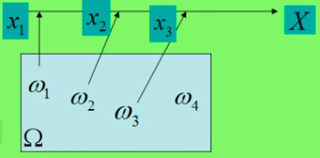
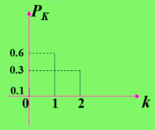

<!-- vim-markdown-toc GFM -->

* [随机变量及其分布](#随机变量及其分布)
	* [回顾](#回顾)
	* [随机变量的概念](#随机变量的概念)
	* [离散型随机变量及其分布律](#离散型随机变量及其分布律)
		* [例题](#例题)
	* [随机变量的分布函数](#随机变量的分布函数)
		* [例题](#例题-1)
		* [分布函数的求法](#分布函数的求法)
	* [连续性随机变量及其概率密度](#连续性随机变量及其概率密度)
	* [随机变量的函数分布](#随机变量的函数分布)
	* [作业](#作业)

<!-- vim-markdown-toc -->

# 随机变量及其分布
## 回顾
- 第一章讲的随机试验中的实验结果有的可以用数来表示。
	- 例如，掷骰子出现的点数可以用数字 1、2、3、4、5、6 来表示。
	- 样本空间 $\Omega = \left\{ 1, 2, 3, 4, 5, 6 \right\}$
- 有些结果不是用数字表示的。
- 例如，掷硬币的结果是：正面(H)和反面(T)。
	- 样本空间 $\Omega = \left\{ 正面, 反面 \right\} = \left\{ H, T \right\}$
- 为了便于用数学工具研究随机现象的统计规律性，我们将各种不同的随机试验的结果，及样本空间$\Omega$中的每一个元素$\omega$与一个实数$x$对应起来，从而引入随机变量的概念。
	- 例如，将掷硬币的试验结果，正面(T)和反面(H)，分别用 1 和 0 表示，则为$\Omega = \left\{ 1, 0 \right\}$
## 随机变量的概念
- 定义 1（随机变量）
	- $设 E 是随机试验，它的样本空间为\Omega = \left\{ \omega \right\}, 如果对于每一个样本点\omega，有一个实数X(\omega)和它对应，\\这样就得到一个定义在样本空间\Omega上的实值函数X(\omega), 称X(\omega)为随机变量。$
- 
- $随机变量常用希腊字母 \xi, \eta, \zeta 或大写英文字母 X, Y, Z 等表示。$
## 离散型随机变量及其分布律
> **在所有的随机变量中有一类随机变量最简单，他只取有限个或可数个不同值。**
- 定义 2
	- $设X是定义在样本空间 \omega 上的随机变量。如果 X 的全部可能取值只有有限或可数个，\\则称 X 是离散型随机变量。$
- 定义 3
- $设 X 是离散型随机变量，其全部可能取值记为 \left\{ x_1, i = 1, 2, \cdots \right\} \\为离散型随机变量 X 的概率函数或分布律或分布列，并记作 X \sim \left\{ X = x_i \right\} = p(x_i) = p_i, i = 1, 2, \cdots 则称数列 \left\{ p(x_i), i = 1, 2, \cdots \right\} , 符号“\sim”读作“服从”，他表示 X 遵从的分布 \left\{ p(x_i), i = 1, 2, \cdots \right\}。$
- 离散型随机变量 X 的概率函数（分布列）可以用表格法来表示：

| X                                  | $x_1$ | $x_2$ | $\cdots$ | $x_i$ | $\cdots$ |
|------------------------------------|-------|-------|----------|-------|----------|
| $P \left\{ X = X_i \right\} = p_i$ | $p_1$ | $p_2$ | $\cdots$ | $p_i$ | $\cdots$ |

- 容易看出，任何一个离散型随机变量的概率分布$p(x_i), i = 1, 2, \cdots$必然满足以下性质：
	1. $p(x_i) \geq 0, i = 1, 2, \cdots$
	2. $\Sigma_{i=0}^{\infty}p(x_i)=1, i=1, 2, \cdots$

### 例题
- **例 1** 投掷一枚均匀硬币，设 $X$ 为一次投掷中出现正面的次数，即
$$
X(\omega)=
\left\{
\begin{aligned}
1, \omega=正面 \\
0, \omega=反面 \\
\end{aligned}
\right.
$$
- 则有
$$
\begin{aligned}
P \left\{ X=1 \right\}=P \left\{ 出现正面 \right\}= \frac{1}{2} \\
P \left\{ X=0 \right\} = P \left\{ 出现反面 \right\} = \frac{1}{2}
\end{aligned}
$$
- 于是 X 的概率分布为：

	| X | 0             | 1             |
	|---|---------------|---------------|
	| P | $\frac{1}{2}$ | $\frac{1}{2}$ |
- **例 2** 从中任取三个球，取到的白球数 X 可能取的值是 0，1，2，去每个值的概率为
	- 取每个值的概率为
	 $P(X=0)= \frac{C^3_3}{C^3_5}= \frac{1}{10}$
	 $P(X=1)= \frac{C^2_3C^1_2}{C^3_5}= \frac{6}{10}$
	 $P(X=2)= \frac{C^1_3C^2_2}{C^3_5}= \frac{3}{10}$
- **分布律的表示方法**
	1. 列表法：
$X \sim
\begin{bmatrix}
0 & 1 & 2 \\ \\
\frac{1}{10} & \frac{6}{10} & \frac{3}{10} \\
\end{bmatrix}$
  
	2. 图示法：
    
	3. 公式法：$P(X=k)= \frac{C^{3-k}_3C^k_2}{C^3_5}, k = 0, 1, 2$

## 随机变量的分布函数
- **定义 4** 设 X 是一随机变量，则称函数$F(x)=P(X \leq x), x \in (-\infty, +\infty)$为随机变量 X 的分布函数。
- 分布函数的性质：
	1. 单调性：$若x_1 \leq x_2, 则F(x_1) \leq F(x_2)$
	2. $$F(-\infty)=\lim_{x \rightarrow -\infty}F(x)=0; F(+\infty)=\lim_{x \rightarrow +\infty}F(x)=1$$
	3. 右连续性：$F(x+0)=F(x), \forall x \in R$
> 如果将 X 看成是数轴上的随机点的坐标，那么分布函数 F(x) 在 x 处的函数值就表示 X 落在区间$( -\infty, x ]$上的概率。
>  若已知 X 的分布函数，就知 X 落在任意区间(a, b]上的概率
>  从几何意义上加以说明将区间端点 x 沿数轴无限向左移动（即$x \rightarrow -\infty$）,则“随机点 X 落在点 x 的左边”这一事件趋于不可能事件，从而其概率趋于 0，
>  即有$F(-\infty)=0;$将点 x 无限右移（即$x \rightarrow \infty$），则“随机点 X 落在点 x 左边”这一事件趋于必然事件，从来其概率趋于 1，即有$F(-\infty)=1。$
### 例题
1. 设随机变量 X 的分布函数是
$
F(x)= \left\{
\begin{aligned}
\frac{A}{2}e^x ; x \leq 0 \\
\frac{1}{2} ; 0 < x \leq 1 \\
B+Ce^{-(x-1)} &; x > 1 \\
\end{aligned}
\right.
$求A, B, C的值
	- 解：由于分布函数的右连续性知
$$
F(0+0)=\lim_{x \rightarrow 0+0}F(x)=F(0), F(1+0)=\lim_{x \rightarrow 1+0}F(x)=F(1) \\
即 \frac{1}{2}= \frac{A}{2}, B+C= \frac{1}{2} \\
又 \lim_{x \rightarrow \infty}F(+\infty)=1, \therefore B=1 \\
于是得 A=1, B=1, C= -\frac{1}{2}
$$
- 离散型随机变量的分布函数
	- 设 X 由例 1 给出，求其分布函数。
	- 解：X 只有两个可能取值，其概率分布为：
$$
P \left\{ x=0 \right\}=P \left\{ x=1 \right\}= \frac{1}{2} \\
当 x<0时，F(x)=P \left\{ X \leq x \right\} = 0。 \\
当0 \leq x < 1时，F(x)=P \left\{ X \leq x \right\}=P \left\{ X = 0 \right\} = \frac{1}{2}
当x \geq 1时，F(x)=P \left\{ X \leq x \right\}\\ \\ =P \left\{ X =0 \right\} + P \left\{ X =1 \right\}= \frac{1}{2}+ \frac{1}{2}=1
$$
综上所述，X 的分布函数为
$$
F(x)= \left\{
\begin{aligned}
0, & x \leq 0; \\
\frac 12, & 0 \leq x < 1; \\
1, & x \geq 1;
\end{aligned}
\right.
$$
### 分布函数的求法
- 确定分段数
	- 分段数为 x 可能取值个数加 1
- 找出分段点
	- X 的可能取值即为F(x)的分段点
- 分段表示
	- 第一分段：$x < x_1, 中间分段均为x_i \leq x < x_{i+1}, 最后一段x \geq x_n$
- 算出每一段上的累计概率

## 连续性随机变量及其概率密度
1. 两点分布
## 随机变量的函数分布

## 作业
1. 考虑为期一年的一张保险单，若投保后一年内因意外死亡，则公司赔付 20 万元，若投保人因其他原因死亡，则公司赔付 5 万元，若投保人在投保期末生存，则公司无需付给任何费用，若投保人在一年内因意外死亡的概率为 0.0002，因其他原因死亡的概率为 0.0010，求公司赔付金额的分布律。
$$
\because P(意外死亡率)= 0.02\%，P(其他原因死亡率)= 0.1\%，P(存活率)=99.88\% \\
\therefore X \sim \begin{bmatrix}
0 元 & 5 万元 & 20 万元 \\ \\
99.88\% & 0.1\% & 0.02\%
\end{bmatrix}
$$
- 2题
	1. 一袋中装有 5 只球，编号为 1，2，3，4，5，在袋中同时取 3 只，以 X 表示取出的 3 只球中的最大号码，写出随机变量 X 的分布律。
$$
\because \Omega = \left\{ 123, 134, 124, 234, 145,135,125,235,245,345 \right\}, X=3,4,5\\
P(X=3)= \frac{1}{10}, P(X=4)= \frac{3}{10}, P(X=5)= \frac{3}{5} \\
\therefore X \sim \begin{bmatrix}
3 & 4 & 5 \\ \\
\frac{1}{10} & \frac{3}{10} & \frac{3}{5} \\
\end{bmatrix}
$$
	2. 将一颗骰子抛掷两次，以 X 表示两次中得到的小的点数，试求 X 的分布律。
$$
\because X=1,2,3,4,5,6，每轮抛掷两次且两次的点数不能相等 \\
\therefore P(X=1)= \frac{1}{6} + \frac{1}{6} - \frac{1}{6} \times \frac{1}{6}= \frac{11}{36} \\ .\\
P(X=2)= \frac{1}{6} \times \frac{5}{6} + \frac{5}{6} \times \frac{1}{6} - \frac{1}{6} \times \frac{1}{6}= \frac{9}{36} \\ .\\
P(X=3)= \frac 16 \times \frac 46 + \frac 46 \times \frac 16 - \frac{1}{36}= \frac{7}{36} \\ .\\
P(X=4)= \frac{1}{6} \times \frac{3}{6} \times 2 - \frac{1}{36}= \frac{5}{36} \\.\\
P(X=5)= \frac{1}{6} \times \frac{2}{6} \times 2- \frac{1}{36}= \frac{3}{36}\\.\\
P(X=6)= \frac{1}{6} \times \frac{1}{6} = \frac{1}{36}\\.\\
X \sim \begin{bmatrix}
1&2&3&4&5&6 \\ \\
\frac{11}{36}& \frac{9}{36}& \frac{7}{36}& \frac{5}{36}& \frac{3}{36}& \frac{1}{36}
\end{bmatrix}
$$
3. 设在 15 只同类型的零件中有 2 只是次品，在其中取 3 次，每次任取 1 只，做不放回抽样，以 X 表示取出的次品的只数。
$$
\because X=0,1,2 \\
P(X=0)= \frac{C_{13}^3}{C_{15}^3}= \frac{22}{35}, P(X=1)= \frac{C_2^1C_{13}^2}{C_{15}^3}= \frac{12}{35}\\
P(X=2)= \frac{C^2_2C^1_{13}}{C_15^3}= \frac{1}{35}\\
X \sim \begin{bmatrix}
0&1&2 \\\\
\frac{22}{35}& \frac{12}{35}& \frac{1}{35}
\end{bmatrix}

$$
