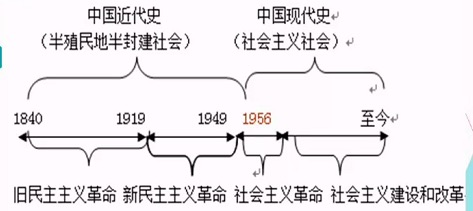

# 导论
## 教材结构
- 上(旧民主主义革命时期)
- 中(新民主主义革命时期)
- 下(社会主义革命时期)

> ### 为什么学习这门课?
> - 保留传承的需要
> ```
> 人类从历史中学到的唯一教训，就是人类没有从历史中吸取任何教训。
>						——黑格尔
> ```
> - 提高人民素质的需要
> - 彰显国力的需要
> - - 中国文化软实力不抵美国十分之一

## 中国近现代史的分期

- 中国近代化也叫现代化， 以经济领域工业还、市场化、信息化，政治领域的民主化、法制化和思想领域的人性化、科学化为主要标志的 **社会主义现代化**

- 学习中国近现代史的目的和要求
	- 了解外国帝国主义入侵中国及其与中国封建势力相结合给中华民族和中国人民带来的深重的苦难
	- 了解近代以来中国面临的两大历史任务，争取民族独立、民族解放和实现国家富强、人民富裕这两项历史人物
	- 自觉的继承和发扬近代以来中国人的爱国主义传统和革命传统，进一步增强民族的自尊心、自信心和自豪感
	- 了解近代以来中国的先进分子和人民群众为救亡图存而进行艰苦探索、顽强奋斗的历程及其经验教训
	- 注意比较地主买办资产阶级、民族资产阶级和工人阶级政党的整治方案，懂得旧民主主义革命让位给新民主主义革命、资产阶级共和国让位给人民共和国的原因


